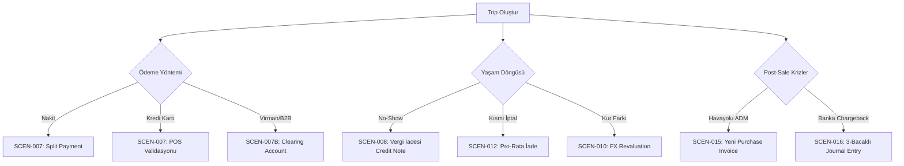

# 🏛️ İzge Travel ERPNext — Konsolide Mimari Doküman (MASTER OVERVIEW)

> **Versiyon:** 1.0 | **Tarih:** 2026-04-17
> **Sistem:** ERPNext v15 on Railway (`erpnext-production-1b2e.up.railway.app`)
> **Custom App:** `izge_travel` (GitHub: `ahmettas21/CRM`)
> **Protokoller:** SOP-4 (Başarı Mühürleme), SOP-5 (Hata Reaksiyon Döngüsü)

Bu doküman, İzge Travel ERPNext sisteminin tüm finansal otomasyon, controller mantığı, UI tetikleyicileri ve raporlama altyapısını tek bir çatı altında toplar. Yeni bir AI oturumu açıldığında veya bir ekip üyesine sistem aktarılırken **tek okunan dosya** bu olmalıdır.

---

## Bölüm 1: 💰 Finans Edge-Case Mimarisi

### 1.1 Mimari Felsefe
İzge Travel bir **Ana Satıcı (Principal — Model B)** olarak konumlandırılmıştır. Havayolu/otel ürünlerini kendi adına satın alır ve kendi adına müşteriye satar. Bu demektir ki:
- Hem **Sales Invoice** (Müşteri faturası) hem de **Purchase Invoice** (Tedarikçi faturası) kesilir.
- Kâr, ikisi arasındaki fark + hizmet bedeli (Service Fee) olarak hesaplanır.
- Tüm muhasebe hareketleri **Immutable Ledger** (değiştirilemez defter) prensibine tabidir.

### 1.2 Doğrulanmış Senaryolar Haritası



### 1.3 Senaryo Detay Tablosu

| ID | Senaryo | ERPNext Belgeleri | Muhasebe Modeli | Durum |
|:---|:---|:---|:---|:---|
| **007/014** | Split Payment (Nakit + POS) | 2× Payment Entry → 1× Sales Invoice | Kasa + POS Banka ayrı PE | ✅ PASSED |
| **007B** | Payment on Behalf (Clearing) | 1× Receive PE + 1× Pay PE + Clearing Account | Clearing hesap daima 0 bakiye | ✅ PASSED |
| **008** | No-Show / Vergi İadesi | Sales Invoice + Credit Note (`is_return=1`) | Sadece vergi kalemi iade edilir, bilet geliri muhafaza | ✅ PASSED |
| **010** | Kur Farkı (Multi-Currency) | Purchase Invoice (EUR) + Payment Entry (EUR→TRY) | Exchange Gain/Loss otomatik | ✅ PASSED |
| **012** | Kısmi İptal (Pro-Rata) | Sales Invoice + Credit Note (oranlanmış) | `İade Oranı = Segment / Toplam`, komisyon da oranlanır | ✅ PASSED |
| **015** | ADM (Agency Debit Memo) | Yeni Purchase Invoice + Cost Center bağlantısı | Orijinal SI bozulmaz, maliyet yeni dönemde arttırılır | ✅ PASSED |
| **016** | Chargeback (Ters İbraz) | Journal Entry (3 bacak: AR Debit + Bank Credit + Expense Debit) | SI immutable kalır, müşteri borcu hortlatılır | ✅ PASSED |

### 1.4 Kalıcı Guardrail'ler (SOP-5'ten Derlenen)

| # | Guardrail | Kaynak |
|:---|:---|:---|
| G1 | Tüm bilet/otel ürünlerinde `is_purchase_item = 1` VE `is_sales_item = 1` aktif olmalı | SCEN-015 |
| G2 | Kapanmış faturalara (SI/PI) asla dokunma; düzeltmeleri Credit Note veya yeni PI ile yap | SCEN-008/015/016 |
| G3 | Item Group yaratırken `parent_item_group` asla boş bırakma, root grubu dinamik SQL ile çek | SCEN-008 |
| G4 | Supplier Group'lar da root hiyerarşi zorunluluğuna tabi; `frappe.db.get_value` ile al | SCEN-015 |
| G5 | Clearing Account kullanıldığında, akış sonunda bakiye kesinlikle 0 olmalı (assertion) | SCEN-007B |
| G6 | Kur farkı senaryolarında `exchange_gain_loss_account` Company seviyesinde tanımlı olmalı | SCEN-010 |
| G7 | `frappe.db.sql` parametreleri her zaman tuple `(val,)` olarak geçilmeli | SCEN-010 |

> 🔗 **Tam Guardrail Listesi:** [wiki/lessons_learned.md](lessons_learned.md)
> 🔗 **Teknik Senaryo Detayları:** [raw/scenarios/edge_cases_brainstorm.md](../raw/scenarios/edge_cases_brainstorm.md)

### 1.5 KDV Politikası (Turizm Ürünleri)

İzge Travel'ın (Ana Satıcı) KDV modeli, Türkiye mevzuatına uygun olarak aşağıdaki temel kurallar üzerine inşa edilmiştir.

**Temel KDV Çerçevesi (2024-2026)**
*   **Yurtiçi Konaklama (Otel, Geceleme):** KDV oranı %10 (sadece konaklama hizmeti). Ekstra servisler %20.
*   **Yurtiçi Uçuş Biletleri:** KDV'ye tabidir (genel oran, %20). Gelir kalemi olarak KDV'li işlenir.
*   **Yurtdışı Uçuş Biletleri:** Türkiye ile yabancı ülkeler arası yolcu taşımacılığı **KDV'den istisnadır**. (Hizmet bedeli / komisyonlar da istisna kapsamında değerlendirilebilir - mali müşavir onayıyla).
*   **Yurtdışı Turlar (Outgoing):** Yurtdışında gerçekleşen maliyetler KDV'ye tabi değildir. Yalnızca acentenin Türkiye'de verdiği hizmet (**Service Fee / Kar Marjı**) genel oranda (%20) KDV'ye tabidir. KDV Matrahı = Toplam Bedel - Yurtdışı Maliyetler.
*   **Yurtiçi Paket Turlar:** Geceleme kısmı %10, diğer hizmetler (ulaşım, tur vb.) %20 olarak ayrıştırılır.

**ERPNext Mimari Yaklaşımı (Çözüm Tasarımı)**

Outgoing turlardaki "matrah indirme" (Toplam - Maliyet) işlemini karmaşık Tax Formülleri ile çözmek yerine **"Item Segmentation" (Kalem Ayrıştırma)** yöntemini benimsiyoruz. Bu yöntem mevcut `Trip` mimarisi (`cost_amount` ve `service_fee` ayrımı) ile mükemmel uyumludur.

1.  **Item & Tax Category Haritalaması:** Her ürün tipi, özel bir `Tax Category`'e bağlanır.
2.  **Sales/Purchase Taxes and Charges Templates:** Seçilen senaryoya göre vergi şablonları hazırlanır (Örn: `TAX-DOMESTIC-PACKAGE-MIXED`, `TAX-INTERNATIONAL-EXEMPT`).
3.  **Matrah Çözümü (Outgoing Tour):** Faturada tur maliyeti (KDV 0 - Exempt) ayrı bir satır, Acente Hizmet Bedeli (KDV %20) ayrı bir satır olarak listelenir. Böylece KDV matrahı doğal yollarla (sadece Invoice Item bazında) sadece hizmet bedeline uygulanır.
4.  **Trip Otomasyonu:** `trip.py`, Sales Invoice yaratırken `product_type` ve `route_type` (Domestic/International/Outgoing) alanlarına bakarak doğru `taxes_and_charges` şablonunu otomatik seçer.

> 🔗 **Detaylı Kurulum Listesi:** KDV ve Tax Template kurulum detayları için [SETUP_CHECKLIST.md](SETUP_CHECKLIST.md)'ye bakınız (Madde 11).

---

## Bölüm 2: ✈️ Trip Controller & Faturalama Otomasyonu

### 2.1 Mimari: "Karar Makamı vs. İcra Makamı"

```
┌──────────────────────────────────────────────┐
│  TRIP DocType (Karar Makamı / Rule Engine)    │
│  ─────────────────────────────────────────    │
│  • validate → calculate_totals()             │
│  • validate → check_margin_guardrail()       │
│  • on_submit → create_purchase_invoices()    │
│  • @whitelist → make_sales_invoice()         │
│  • on_cancel → cancel_sales/purchase_inv()   │
└──────────────┬───────────────────────────────┘
               │ Tetikler
               ▼
┌──────────────────────────────────────────────┐
│  Sales Invoice / Purchase Invoice            │
│  (İcra Makamı — GL/Ledger Sahibi)            │
│  ─────────────────────────────────────────    │
│  • Draft olarak yaratılır                    │
│  • Muhasebeci kontrolüne bırakılır           │
│  • Submit → GL Entry → Ledger                │
└──────────────────────────────────────────────┘
```

### 2.2 trip.py — Python Controller Anatomisi

| Metod | Hook | Görevi |
|:---|:---|:---|
| `calculate_totals()` | `validate` | 4 child tablodan (flight, hotel, service, charge) maliyet/satış/kâr toplar |
| `calculate_cc_commission()` | `validate` | KK ile ödenmişse komisyon tutarını hesaplar |
| `check_margin_guardrail()` | `validate` | `sale < cost` ise kaydetmeyi bloklar (`frappe.throw`) |
| `create_purchase_invoices()` | `on_submit` | Her benzersiz Supplier için ayrı Draft PI oluşturur |
| `create_cc_commission_entry()` | `on_submit` | KK komisyonu için Journal Entry yaratır |
| `make_sales_invoice()` | `@whitelist` | UI butonuyla tetiklenir; Draft SI oluşturur ve Trip'e linkler |
| `cancel_sales_invoice()` | `on_cancel` | İlişkili SI'ları iptal/siler |
| `cancel_purchase_invoices()` | `on_cancel` | İlişkili PI'ları iptal/siler |

> 🔗 **Kaynak Kod:** [trip.py](../izge_travel/izge_travel/izge_travel/doctype/trip/trip.py)

### 2.3 trip.js — Client-Side UI Zekası

| Özellik | Koşul | Davranış |
|:---|:---|:---|
| **Yeni Müşteri Butonu** | `docstatus == 0` | Quick Dialog ile müşteri yaratır + Trip'e linkler |
| **Yeni Yolcu Butonu** | `docstatus == 0` + `customer` dolu | Traveler yaratır + primary_traveler'a set eder |
| **Uçuş Ekle Butonu** | `docstatus == 0` | Large Dialog ile segment + finansal veri ekler |
| **🆕 Fatura Oluştur** | `docstatus == 1` + `profit > 0` + `!customer_invoice_no` | Onay penceresi → `make_sales_invoice` API → reload |
| **Satış/Alış Fatura Linkleri** | `docstatus == 1` | Remarks bazlı filtreyle ilgili fatura listesine yönlendirir |
| **Kâr/Zarar Göstergesi** | Her zaman | Yeşil (kârlı) veya kırmızı (zararlı) headline |
| **Otomatik Hesaplama** | Her child table değişikliğinde | `sale = cost + service + extra`, parent toplamları güncellenir |

> 🔗 **Kaynak Kod:** [trip.js](../izge_travel/izge_travel/izge_travel/doctype/trip/trip.js)

### 2.4 Regresyon Testleri

| Test ID | Kapsam | Sonuç |
|:---|:---|:---|
| **SCEN-TRIP-001** | Margin Guardrail (negatif kâr bloklaması) | ✅ PASSED |
| **SCEN-TRIP-002** | UI Make Invoice API + mükerrer fatura engeli | ✅ PASSED |

> 🔗 **Ham Loglar:** [SCEN-TRIP-001](../raw/scenarios/SCEN-TRIP-001_logic_success_log.txt) · [SCEN-TRIP-002](../raw/scenarios/SCEN-TRIP-002_success_log.txt)

---

## Bölüm 3: 📊 Dashboard & Raporlama Blueprint

### 3.1 Panel Özeti

| # | Panel | Veri Kaynağı | Ana Metrikler | Widget'lar |
|:---|:---|:---|:---|:---|
| 1 | **Sales & Profitability** | `tabTrip` (docstatus=1) | Satış, kâr, marj %, trip sayısı | Number Card (×4) + Line Chart + Donut + Top 10 Tablo |
| 2 | **ADM Alert** | `tabPurchase Invoice` (remarks LIKE ADM) | ADM adedi, tutarı, havayolu bazlı | Number Card (×2) + Bar Chart + Detay Tablo |
| 3 | **Chargeback Risk** | `tabTrip` (payment_method=Credit Card) | KK satışı, açık risk, yaşlandırma | Number Card (×2) + Pie Chart + Risk Tablo |
| 4 | **Operational Health** | `tabTrip` (profit ≤ 0 veya invoice boş) | Zararlı trip, faturasız trip | Number Card (×2) + Donut + Detay Tablo |

### 3.2 Filtre Matrisi

| Filtre | Panel 1 | Panel 2 | Panel 3 | Panel 4 |
|:---|:---|:---|:---|:---|
| `from_date / to_date` | ✅ (30 gün) | ✅ (90 gün) | ✅ (180 gün) | ✅ (30 gün) |
| `product_type` | ✅ | — | — | — |
| `customer` | ✅ | — | ✅ | — |
| `sales_owner` | ✅ | — | — | — |
| `supplier` | — | ✅ | — | — |
| `cc_bank` | — | — | ✅ | — |
| `status` | — | — | — | ✅ |

### 3.3 Uygulama Planı (Frappe Teknik)

```
Faz 1 → Script Report: "Trip Profitability Report"
         (.py SQL + .js filtreler + .json metadata)
         
Faz 2 → Script Report: "Trip Health Report"
         
Faz 3 → Number Card + Dashboard Chart → Workspace entegrasyonu
         
Faz 4 → Script Report: "ADM Tracking Report" + "Chargeback Risk Report"
```

### 3.4 Regresyon Testi

| Test ID | Kapsam | Assertion Sayısı | Sonuç |
|:---|:---|:---|:---|
| **SCEN-DASH-001** | Core SQL + margin + aggregate + filtre + widget + health | 6/6 | ✅ PASSED |

**Canlı Metrikler (Test Anı):** 2 Trip, 26.800 TL Satış, 9.700 TL Kâr, %36.2 Marj, 0 Zararlı Trip.

> 🔗 **Detaylı Blueprint:** [wiki/dashboard_blueprint.md](dashboard_blueprint.md)
> 🔗 **Test Logu:** [SCEN-DASH-001](../raw/scenarios/SCEN-DASH-001_success_log.txt)

---

## Bölüm 4: 🧭 Açık Kalan & Gelecek Adımlar

> 🚀 **Pilot Kullanım:** Sistemi devreye almak için sadece 13 ayar yeterlidir. Detaylar için → [MVP Setup (SETUP_CHECKLIST.md#mvp)](SETUP_CHECKLIST.md#-mvp-setup--pilot-kullanım-i̇çin-minimum-paket)

### 4.1 Kısa Vadeli (Hemen Kodlanabilir)

| # | Görev | Bağımlılık | Tahmini Efor |
|:---|:---|:---|:---|
| 1 | Dashboard Script Report'ları implement et (Faz 1-2) | Blueprint hazır | 1-2 saat |
| 2 | Number Card + Dashboard Chart → Workspace entegrasyonu | Script Report gerekli | 1 saat |
| 3 | `trip.js` "Fatura Oluştur" railway'e sync | trip.py zaten synced | 15 dk |
| 4 | SCEN-DASH-002/003/004 regresyon testleri | Blueprint hazır | 1 saat |

### 4.2 Orta Vadeli (Tasarım Gerekli)

| # | Görev | Açıklama | Referans |
|:---|:---|:---|:---|
| 5 | **SCEN-BEE-009**: Service Fee POS Separation | Bilet B2B virman + hizmet bedeli ayrı POS | edge_cases_brainstorm.md |
| 6 | **SCEN-BEE-011**: B2B Alt Acenta + Depozito | Customer Advance + Credit Limit | edge_cases_brainstorm.md |
| 7 | **SCEN-BEE-013**: Group Booking (Blok Rezv) | Master Trip + Sub-trip + Seat Spoilage | edge_cases_brainstorm.md |
| 8 | **SCEN-BEE-017**: Triple-Currency Booking | USD + EUR + TRY aynı Trip'te | edge_cases_brainstorm.md |
| 9 | **Duty of Care**: Konum takibi, acil durum | mission_control.md #3 | Henüz tasarlanmadı |
| 10 | **Visa World**: Vize Dünyası entegrasyonu | Stratejik ortaklık | Henüz tasarlanmadı |

### 4.3 Uzun Vadeli (Vizyon)

| # | Görev | Açıklama |
|:---|:---|:---|
| 11 | CI/CD Pipeline | Regresyon scriptlerini GitHub Actions'a entegre et |
| 12 | Aqua Import V2 | Çoklu GDS (Galileo, Amadeus) veri beslemesi |
| 13 | Müşteri Portalı | Self-service rezervasyon sorgulama |
| 14 | Mobile App (PWA) | Saha personeli için mobil Trip yönetimi |

### 4.4 Bilinen Teknik Borçlar

| # | Borç | Etki | Çözüm Önerisi |
|:---|:---|:---|:---|
| T1 | `trip.py` `_ensure_item` her seferinde `is_purchase_item` kontrolü yapmıyor | Satış ürünleri PI'da hata verebilir | `_ensure_item` metoduna `is_purchase=True` flag'i eklendi ama mevcut Item'lar güncellenmedi |
| T2 | `bench restart` Railway'de supervisor hatası veriyor | Kod değişiklikleri anında yansımıyor | Alternatif: `bench clear-cache` veya container yeniden deploy |
| T3 | Airport/Airline DocType'larına henüz seed data girilmedi | Test scriptleri dinamik veri çekmek zorunda | Bir setup scriptiyle IATA havalimanı listesini import et |
| T4 | `trip.js` henüz Railway'e push edilmedi | UI butonu production'da görünmüyor olabilir | `git push` veya base64 sync gerekli |

---

## Ek: Dosya Referans Haritası

### Wiki Katmanı (Kavramsal)
| Dosya | İçerik |
|:---|:---|
| [wiki/index.md](index.md) | Ana navigasyon |
| [wiki/mission_control.md](mission_control.md) | Proje hedefleri ve durum panosu |
| [wiki/log.md](log.md) | Kronolojik değişim günlüğü |
| [wiki/lessons_learned.md](lessons_learned.md) | Guardrail'ler ve hata analizleri |
| [wiki/dashboard_blueprint.md](dashboard_blueprint.md) | 4-panel dashboard tasarımı |
| [wiki/UX_FLOWS.md](UX_FLOWS.md) | Satışçı ve Muhasebe ekran akışları |
| [wiki/SETUP_CHECKLIST.md](SETUP_CHECKLIST.md) | Zorunlu ERPNext ayarları (~38 kontrol) |
| [wiki/scenarios/index.md](scenarios/index.md) | Senaryo kayıt defteri |
| **wiki/MASTER_OVERVIEW.md** | **Bu doküman** |

### Raw Katmanı (Teknik)
| Dosya | İçerik |
|:---|:---|
| [raw/scenarios/edge_cases_brainstorm.md](../raw/scenarios/edge_cases_brainstorm.md) | Tüm finansal edge-case'ler |
| raw/scenarios/SCEN-*_success_log.txt | Başarılı test logları |
| raw/scenarios/SCEN-*_error_log*.txt | Hata analiz logları |

### Kod Katmanı
| Dosya | İçerik |
|:---|:---|
| [trip.py](../izge_travel/izge_travel/izge_travel/doctype/trip/trip.py) | Python controller (378 satır) |
| [trip.js](../izge_travel/izge_travel/izge_travel/doctype/trip/trip.js) | Client script (387 satır) |
| [trip.json](../izge_travel/izge_travel/izge_travel/doctype/trip/trip.json) | DocType şeması (470 satır, 50 alan) |

### Test Scriptleri (tmp/)
| Dosya | Senaryo |
|:---|:---|
| tmp/run_scenario_trip_001.py | SCEN-TRIP-001 |
| tmp/run_scenario_trip_002.py | SCEN-TRIP-002 |
| tmp/run_scenario_dash_001.py | SCEN-DASH-001 |
| tmp/run_scenario_007.py … 016.py | SCEN-BEE-007 … 016 |

---

> 📌 **Bu doküman, projenin "tek kaynak gerçeği" (Single Source of Truth) olarak korunmalı ve her büyük değişiklikte güncellenmelidir.**
