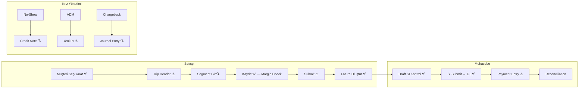

# 🖥️ İzge Travel — Kullanıcı Ekran Akışları (UX Flows)

> **Versiyon:** 2.0 | **Tarih:** 2026-04-17
> **Hedef Kitle:** Satışçı/Operasyon Ekibi ve Muhasebe Ekibi
> **Referans:** [MASTER_OVERVIEW.md](MASTER_OVERVIEW.md)

Bu doküman, İzge Travel ERPNext sistemini günlük olarak kullanan iki temel rolün (Satış ve Muhasebe) ekran akışlarını adım adım tanımlar.

### Kullanılabilirlik Etiketleri

| Etiket | Anlam |
|:---|:---|
| ✅ OK | Basit, hata riski düşük, kullanıcıya güvenle bırakılabilir |
| ⚠️ Dikkat | Dikkatli veri girişi gerekli; yanlış yapılırsa düzeltmesi zahmetli |
| 🔍 Gözden Geçir | Karmaşık veya riskli; eğitimsiz kullanıcının hata yapma olasılığı yüksek |

---

## Rol 1: ✈️ Satışçı / Operasyon (Biletçi)

### Akış 1.1 — Yeni Rezervasyon Oluşturma

```
Müşteri Teyidi → Trip Formu → Segment Girişi → Finansal Kontrol → Submit
```

#### Adım 1: Müşteri Kontrolü veya Yaratma — ✅ OK
| Ekran | Alan | İşlem |
|:---|:---|:---|
| **Trip Formu** | `Müşteri` (customer) | Mevcut müşteriyi arayıp seçin |
| — veya — | **"Yeni Müşteri"** butonu | Hızlı İşlemler menüsünden tıklayın |
| Quick Dialog | `Müşteri Adı`, `Tür` (Individual/Company), `Telefon`, `E-posta` | Doldurup "Oluştur" deyin |

> 💡 **İpucu:** Müşteri oluşturulduktan sonra otomatik olarak Trip'in `Müşteri` alanına set edilir.
> ✅ **UX Notu:** Diyalog basit, 4 alan. Mükerrer müşteriye karşı ERPNext kendi uyarır. Düşük risk.

#### Adım 2: Trip Header Bilgileri — ⚠️ Dikkat
| Alan | Zorunlu | Açıklama |
|:---|:---|:---|
| `Rezervasyon Tarihi` (booking_date) | ✅ | Müşterinin rezervasyon yapıldığı tarih |
| `PNR (Rezervasyon Kodu)` (booking_reference) | ✅ | GDS'ten alınan PNR kodu (otomatik UPPERCASE) |
| `Müşteri` (customer) | ✅ | Adım 1'de seçilen/yaratılan müşteri |
| `Ana Yolcu` (primary_traveler) | — | İlk yolcuyu burada seçin veya "Yeni Yolcu" ile yaratın |
| `Yolcu Sayısı` (pax_count) | — | Kaç kişilik rezervasyon |
| `Ürün Tipi` (product_type) | — | Flight / Hotel / Package / vb. |
| `Satış Sorumlusu` (sales_owner) | — | Bu satışı yapan kullanıcı |
| `Ofis` (office) | — | İZGE TURİZM 2018 veya SANCAKTEPE 2018 |

> ⚠️ **UX Notu:** PNR alanı `unique` — yanlış veya mükerrer PNR girilirse kayıt reddedilir. Satışçıyı GDS'ten PNR'yi kopyala-yapıştır yapmaya yönlendirin. Manuel yazımda hata riski orta.

#### Adım 3: Yolcu Oluşturma (Gerekirse) — ✅ OK
| Ekran | İşlem |
|:---|:---|
| **"Yeni Yolcu"** butonu (Hızlı İşlemler) | Müşteri seçili olmalı; yoksa uyarı verir |
| Quick Dialog | `Ünvan` (MR/MRS/CHD/INF), `Ad Soyad` ✅, `Telefon`, `E-posta`, `Pasaport No`, `Pasaport Bitiş`, `Doğum Tarihi`, `Uyruk` |

> ✅ **UX Notu:** Diyalog basit. Müşteri seçili değilse buton uyarı veriyor — doğal koruma mevcut.

#### Adım 4: Uçuş Segmenti Ekleme — 🔍 Gözden Geçir
İki yöntem vardır:

**Yöntem A — Hızlı İşlemler Butonu (ÖNERİLEN):**
| Ekran | İşlem |
|:---|:---|
| **"Uçuş Ekle"** butonu | Large Dialog açılır |
| Dialog Alanları | `Yolcu` ✅, `Yön` ✅ (Outbound/Return), `Nereden` ✅ (IATA), `Nereye` ✅ (IATA), `Havayolu`, `Uçuş No`, `Uçuş Tarihi` ✅, `Kalkış/İniş Saati`, `Bilet No`, `Tedarikçi`, `Maliyet` ✅, `Hizmet Bedeli`, `Ekstra` |

**Yöntem B — Doğrudan Tablo Girişi:**
| Ekran | İşlem |
|:---|:---|
| "Uçuş Segmentleri" bölümü | "Satır Ekle" ile doğrudan tabloya girin |

> 📊 **Otomatik Hesaplama:** Her satırda `Satış = Maliyet + Hizmet + Ekstra` formülü anında çalışır.

> 🔍 **UX Notu — YÜKSEK RİSK:**
> - **Alan sayısı fazla** (~13 alan). Eğitimsiz kullanıcıda bunalma riski var.
> - **Maliyet/Hizmet Bedeli karıştırılabilir.** Satışçıya net bir kural verin: "Maliyet = havayoluna ödenen, Hizmet Bedeli = müşteriye eklediğiniz".
> - **Airport/Airline Link alanları** boş database'de çalışmaz. MVP Setup #11 ve #12 tamamlanmalı.
> - **Tedarikçi zorunlu** — boş bırakılırsa Submit aşamasında hata verir.
> - **Öneri:** Yöntem A'yı (Large Dialog) varsayılan yol olarak eğitin; Yöntem B ileri düzey kullanıcılar için.

#### Adım 5: Otel / Hizmet / Ekstra Ücret — ⚠️ Dikkat
| Bölüm | Ne Zaman Kullanılır | UI / Eğitim Kılavuzu |
|:---|:---|:---|
| **Otel Konaklamaları** | `product_type = Hotel` veya `Package` seçildiğinde görünür | **Örn (Kapadokya 3 Gece):** Gece başı maliyet 8.000 TL, Satış 10.000 TL yazılır. Otomatik kâr hesaplanır. |
| **Hizmetler (Vize vb.)** | `product_type = Service` seçildiğinde Uçuş tabloları gizlenir, sadece bu tablo kullanılır. | **Örn (VIP Schengen Vize):** Maliyet 0, Satış 3.000 TL (Sadece bizim danışmanlık hizmet/kâr bedelimiz yazılır). |
| **Ekstra Ücretler** | CIP, Bagaj, Koltuk seçimi gibi ek masraflar için. | **Örn (Konsolosluk Harcı):** Maliyet 4.000 TL, Satış 4.000 TL. KDV'siz (Pass-through) yansıtılacak öğeler içindir. |

> ⚠️ **UX Notu (KDV Çakışma Riski):**
> - Satışçılara net kural: "KDV matrahına girecek kendi hizmet bedelini Hizmetler tablosuna, aracı olduğun ve sana KDV yükümlülüğü yaratmayan konsolosluk harçlarını (Exempt/Sıfır KDV) Ekstra tablosuna yaz."
> - `product_type = Service` olduğunda uçak ve otel sekmelerinin kapanması satışçı UI sadeliği için faydalıdır.

#### Adım 6: Ödeme Bilgileri — ⚠️ Dikkat
| Alan | Seçenekler | Not |
|:---|:---|:---|
| `Ödeme Yöntemi` (payment_method) | Cash / Credit Card / Bank Transfer / Credit (Vadeli) / Split | KK seçilirse komisyon alanları açılır |
| `KK Bankası` (cc_bank) | Garanti / İş Bankası / Yapı Kredi / … | Sadece KK seçildiğinde görünür |
| `KK Komisyon Oranı` (cc_commission_rate) | Varsayılan %2.5 | Otomatik hesaplanır |
| `Son Ödeme Tarihi` (payment_due_date) | Tarih | Vadeli satışlar için |

> ⚠️ **UX Notu:**
> - KK komisyon oranı bankaya göre değişebilir. Varsayılan %2.5 her zaman doğru olmayabilir — satışçıya banka ile kontrol ettirin.
> - `Split` ödeme seçeneği henüz UI'da otomatik bölünmüyor; muhasebe ekibi 2 ayrı PE yapmalı.
> - Vadeli satışlarda `Son Ödeme Tarihi` boş bırakılırsa varsayılan olarak bugün yazılır — gerçek vadeyi girin.

#### Adım 7: Kaydet ve Gözden Geçir — ✅ OK
| Kontrol | Ne Olur |
|:---|:---|
| **Kaydet (Ctrl+S)** | `validate` çalışır → toplamlar hesaplanır → margin guardrail kontrol edilir |
| 🟢 Kârlı | Yeşil başlık: "✅ Kâr: X TL \| Marj: Y%" |
| 🔴 Zararlı | Kırmızı başlık: "⚠️ DİKKAT: Bu trip zararda!" — **Kayıt bloklanır!** |

> ✅ **UX Notu:** Guardrail otomatik çalışır; kullanıcı müdahale etmek zorunda değil. Zararlı kayıt yapılamaz. Mükemmel koruma.

#### Adım 8: Submit (Onaylama) — ⚠️ Dikkat
| İşlem | Otomatik Sonuç |
|:---|:---|
| **Submit** butonuna tıklayın | Her benzersiz Supplier için **Draft Purchase Invoice** yaratılır |
| — | KK ile ödeme varsa **CC Commission Journal Entry** yaratılır |
| — | Trip durumu `Submitted` olur |

> ⚠️ **UX Notu:** Submit geri alınamaz (sadece Amend veya Cancel ile). Satışçıya "Submit ettikten sonra düzeltme yapamazsın, önce her şeyi kontrol et" kuralını eğitimde vurgulayın.

#### Adım 9: Fatura Oluştur — ✅ OK
| Koşul | Görünürlük |
|:---|:---|
| Trip submitted + Kârlı + Henüz fatura yok | ✅ **"Fatura Oluştur"** butonu `Muhasebe` menüsünde görünür |
| Muhasebe → Fatura Oluştur | Onay penceresi → Draft Sales Invoice yaratılır |
| Fatura zaten varsa | Buton kaybolur; tekrar tetiklenirse hata verir |

> ✅ **UX Notu:** Buton sadece uygun koşullarda görünüyor. Mükerrer koruma aktif. Satışçı güvenle tıklayabilir.

---

### Akış 1.2 — Mevcut Rezervasyonu Güncelleme — 🔍 Gözden Geçir

```
Trip Listesi → Trip Aç → Amend → Değişiklikleri Kaydet → Re-Submit
```

| Adım | İşlem |
|:---|:---|
| 1 | Trip listesinden PNR veya müşteri ile arayın |
| 2 | Trip'i açın → **Amend** butonuna basın (Copy + Cancel oluşur) |
| 3 | Segment ekleyin/çıkarın, fiyatları güncelleyin |
| 4 | Kaydedin → Margin kontrolünden geçtiğini doğrulayın |
| 5 | Submit edin |

> 🔍 **UX Notu — YÜKSEK RİSK:**
> - Amend, orijinal Trip'i Cancel eder ve **tüm ilişkili faturaları (SI/PI) iptal eder.**
> - Satışçıya Amend kullanmadan önce kesinlikle muhasebe ekibine danışma kuralı koyun.
> - Eğer fatura zaten Submit edilmiş ve ödeme bağlanmışsa, Amend çok karmaşık bir iptal zincirine neden olur.
> - **Öneri:** Satışçıya Amend yetkisi verilmemesini (Permission bazlı kısıtlama) değerlendirin. Veya sadece Draft aşamasındaki Trip'ler için Amend izni verin.

---

### Akış 1.3 — İptal ve İade — 🔍 Gözden Geçir

```
Trip Aç → Cancel → [Gerekirse] Credit Note Oluştur
```

| Senaryo | Akış |
|:---|:---|
| **Tam İptal** | Trip → Cancel (tüm SI/PI otomatik iptal edilir) |
| **Kısmi İade (No-Show)** | Trip iptal EDİLMEZ; Muhasebe ekibi Credit Note keser (SCEN-008) |
| **Pro-Rata İade** | Trip iptal EDİLMEZ; Muhasebe ekibi oranlanmış Credit Note keser (SCEN-012) |

> 🔍 **UX Notu — KRİTİK SINIRLAMA:**
> - Satışçı iptal/iade muhasebe belgesini kendisi **yaratamaz**. Bu bilinçli bir tasarım kararıdır.
> - Satışçı sadece Trip durumunu değiştirebilir. Credit Note yetki ve bilgi gerektirdiği için muhasebe ekibi sorumludur.
> - **Eğitim Vurgusu:** "No-show olsa bile Trip'i Cancel etme! Muhasebe'yi bilgilendir."

---

## Rol 2: 💼 Muhasebe Ekibi

### Akış 2.1 — Fatura Kontrol ve Onay — ✅ OK

```
Draft SI Listesi → Kontrol → Submit → Defter Kaydı (GL)
```

#### Adım 1: Draft Faturaları Bul
| Ekran | Filtre |
|:---|:---|
| Sales Invoice Listesi | `Status = Draft`, `Posting Date = Bugün` |
| — veya — | Trip içinden `Muhasebe → Satış Faturaları` butonu |

#### Adım 2: Fatura Kontrolü
| Kontrol Noktası | Amaç |
|:---|:---|
| `Customer` doğru mu? | Yanlış müşteriye kesilmesini önler |
| `Items` tablosu | Bilet, hizmet bedeli, ekstra kalemleri doğrula |
| `Taxes and Charges` | Seçilen vergi şablonu (Örn: `TAX-INTL-FLIGHT`) rota ile uyumlu mu? |
| `KDV Matrahı ve Oranı` | Yurtdışı uçuşta KDV %0, Hizmet bedelinde %20 mi hesaplanmış? (Muhasebeci inisiyatifi) |
| `Grand Total` | Trip'teki `total_sale_amount` ile eşleşmeli |
| `Remarks` | PNR ve Trip referansını kontrol et |
| `Due Date` | Vadeli satışlarda ödeme tarihini doğrula |

#### Adım 3: Submit (GL Kaydı)
| İşlem | Sonuç |
|:---|:---|
| SI → Submit | GL Entry'ler oluşur: Gelir hesabı (Credit) + Müşteri AR (Debit) |
| PI → Submit | GL Entry'ler oluşur: Gider hesabı (Debit) + Tedarikçi AP (Credit) |

> ✅ **UX Notu:** Standart ERPNext fatura akışı. Muhasebeci zaten aşina olmalı. Kontrol listesi yukarıda verildi.

---

### Akış 2.2 — Tahsilat (Payment Entry) — ⚠️ Dikkat

```
SI Listesi → Outstanding > 0 → Payment Entry → Reconciliation
```

| Adım | İşlem |
|:---|:---|
| 1 | Açık (Outstanding > 0) faturaları filtreleyin |
| 2 | SI açın → **Make Payment Entry** butonuna tıklayın |
| 3 | Ödeme bilgilerini doldurun: Hesap, Tutar, Referans No (POS için) |
| 4 | Submit edin |

| Ödeme Yöntemi | Hesap | Referans |
|:---|:---|:---|
| Nakit | Nakit Kasa (Cash) | — |
| Kredi Kartı POS | POS Banka Hesabı | Referans No ✅ + Tarih ✅ |
| Banka Havalesi | Banka Hesabı | Dekont No |
| Split | 2 ayrı Payment Entry | Her biri kendi hesabına |

> ⚠️ **UX Notu:**
> - POS ödemelerinde `Reference No` ve `Reference Date` zorunludur (ERPNext validasyonu). Boş bırakılırsa hata verir.
> - Split ödeme 2 ayrı PE gerektirir. Tek PE ile iki hesaba yönlendirme mümkün değildir.

---

### Akış 2.3 — Kısmi/Tam İade (Credit Note) — 🔍 Gözden Geçir

```
SI Aç → Make Credit Note → Kalemi Düzenle → Submit
```

| Senaryo | İşlem |
|:---|:---|
| **No-Show (SCEN-008)** | Orijinal SI'dan Credit Note yap → Sadece `AIRPORT-TAX` kalemini tut, diğerlerini sil → Submit |
| **Pro-Rata (SCEN-012)** | Orijinal SI'dan Credit Note yap → İade oranını hesapla → Bilet + oranlanmış komisyon kalemlerini düzenle → Submit |

> 🔍 **UX Notu — YÜKSEK RİSK:**
> - Yanlış kalem silinirse veya tutar hatalı girilirse P&L bozulur

> - Pro-rata hesaplama manuel yapılıyor. Formül: `İade Oranı = İptal Edilen Segment / Toplam`. Hata payı yüksek.
> - **Öneri:** Pro-rata hesaplayıcıyı trip.js'e bir helper olarak eklemek Phase 2 için değerlendirilmeli.

> 🛡️ **Altın Kural:** Orijinal SI asla Cancel edilmez. Her zaman Credit Note (`is_return = 1`) ile düzeltilir.

---

### Akış 2.4 — ADM İşleme (SCEN-015) — ⚠️ Dikkat

```
Havayolu ADM Geldi → Yeni Purchase Invoice → Cost Center Bağla → Submit
```

| Adım | İşlem |
|:---|:---|
| 1 | Yeni Purchase Invoice oluşturun (Supplier = ilgili Havayolu) |
| 2 | `Remarks` alanına "ADM — [Trip Referansı]" yazın |
| 3 | Item olarak `ADM-MALIYET` veya `BILET-MALIYETI` ekleyin |
| 4 | `Cost Center` alanını ilgili Trip'in Cost Center'ına bağlayın |
| 5 | Submit edin |

> ⚠️ **UX Notu:** ADM'nin doğru Trip'e bağlanması kritik. Yanlış Cost Center seçilirse kârlılık raporu bozulur.

> ⚠️ Orijinal Sales Invoice'a **asla** dokunulmaz.

---

### Akış 2.5 — Chargeback Müdahale (SCEN-016) — 🔍 Gözden Geçir

```
Banka Bildirim → Journal Entry (3 Bacak) → Müşteri Takibe Al
```

| Bacak | Hesap | Debit | Credit |
|:---|:---|:---|:---|
| 1 | Müşteri AR (Debtors) | Ana Para | — |
| 2 | Banka Hesabı | — | Ana Para + Ceza |
| 3 | Banka Masraf Gideri (Expense) | Ceza Tutarı | — |

| Adım | İşlem |
|:---|:---|
| 1 | Journal Entry → Voucher Type: Journal Entry |
| 2 | 3 bacağı yukarıdaki tabloya göre doldurun |
| 3 | `Remark` alanına "Chargeback — [Müşteri] — [SI Referansı]" yazın |
| 4 | Submit edin |
| 5 | Müşteri artık tekrar borçludur; AR raporunda görünür |

> 🔍 **UX Notu — YÜKSEK RİSK:**
> - 3 bacaklı JE, çift taraflı muhasebe bilgisi gerektirir. Yanlış hesap seçimi mizanı bozar.
> - Debit/Credit toplamları eşit olmalıdır (ERPNext bunu zorunlu kılar ama yine de doğru hesaplara yazıldığından emin olun).
> - **Bu akış sadece üst düzey muhasebeci tarafından yapılmalıdır.**

> 🛡️ **Altın Kural:** Sales Invoice immutable kalır. Borcu hortlatmak için sadece JE kullanılır.

---

## Kullanılabilirlik Özet Tablosu

| # | Akış | Rol | Etiket | Ana Risk |
|:---|:---|:---|:---|:---|
| 1.1-1 | Müşteri Seç/Yarat | Satışçı | ✅ OK | — |
| 1.1-2 | Trip Header | Satışçı | ⚠️ Dikkat | PNR mükerrer/hatalı giriş |
| 1.1-3 | Yolcu Oluşturma | Satışçı | ✅ OK | — |
| 1.1-4 | **Uçuş Segmenti** | Satışçı | 🔍 Gözden Geçir | **13 alan, Maliyet/HB karışıklığı, Link boşlukları** |
| 1.1-5 | Otel/Hizmet/Ücret | Satışçı | ✅ OK | — |
| 1.1-6 | Ödeme Bilgileri | Satışçı | ⚠️ Dikkat | KK komisyon oranı, vade tarihi |
| 1.1-7 | Kaydet | Satışçı | ✅ OK | Guardrail otomatik korur |
| 1.1-8 | Submit | Satışçı | ⚠️ Dikkat | Geri alınamaz, fatura zincirlenir |
| 1.1-9 | Fatura Oluştur | Satışçı | ✅ OK | Mükerrer koruma aktif |
| 1.2 | **Amend** | Satışçı | 🔍 Gözden Geçir | **Fatura zincirini kırabilir** |
| 1.3 | **İptal/İade** | Satışçı | 🔍 Gözden Geçir | **No-show'da Cancel etme hatası** |
| 2.1 | Fatura Kontrol/Onay | Muhasebe | ✅ OK | — |
| 2.2 | Tahsilat (PE) | Muhasebe | ⚠️ Dikkat | POS referans zorunluluğu |
| 2.3 | **Credit Note** | Muhasebe | 🔍 Gözden Geçir | **Pro-rata hesap hatası** |
| 2.4 | ADM İşleme | Muhasebe | ⚠️ Dikkat | Yanlış Cost Center |
| 2.5 | **Chargeback JE** | Muhasebe | 🔍 Gözden Geçir | **3 bacak, muhasebe bilgisi şart** |

---

## Akış Özet Diyagramı



---

## 🎓 Eğitim Senaryosu 001: Gidiş-Dönüş + Hizmet Bedeli + KK + No-Show İade

> **Amaç:** Bu senaryo, satışçı ve muhasebe ekibinin tüm temel akışları tek bir örnek üzerinde uçtan uca pratiğe dökmesini sağlar.
> **Süre:** ~30 dakika
> **Ön Koşul:** [MVP Setup (13 ayar)](SETUP_CHECKLIST.md#-mvp-setup--pilot-kullanım-i̇çin-minimum-paket) tamamlanmış olmalı.

### Senaryo Hikayesi

> Müşteri **Mehmet Yılmaz**, İstanbul → Ankara gidiş-dönüş bilet almak istiyor.
> Ödeme: Kredi kartı (Garanti BBVA).
> Sonradan dönüş uçuşunu kullanmıyor (No-Show); sadece vergi iadesi yapılacak.

### Faz 1: Satış (Satışçı Rolü)

| Adım | Ekran / İşlem | Girilen Veri | MVP Bağımlılığı |
|:---|:---|:---|:---|
| **1** | Trip → Hızlı İşlemler → **Yeni Müşteri** | Ad: `Mehmet Yılmaz`, Tür: Individual, Tel: 05XX | MVP #9 (Customer Group) |
| **2** | Trip Header doltur | Tarih: Bugün, PNR: `ABC123`, Ürün: Flight | — |
| **3** | Hızlı İşlemler → **Yeni Yolcu** | Ad: `Mehmet Yılmaz`, Cinsiyet: Male | — |
| **4** | Hızlı İşlemler → **Uçuş Ekle** (Gidiş) | Yolcu: Mehmet, Yön: Outbound, IST→ESB, TK, Tarih: +3 gün, Maliyet: **2.000 TL**, Hizmet: **200 TL**, Tedarikçi: [mevcut] | MVP #10, #11, #12 |
| **5** | Hızlı İşlemler → **Uçuş Ekle** (Dönüş) | Yolcu: Mehmet, Yön: Return, ESB→IST, TK, Tarih: +5 gün, Maliyet: **1.500 TL**, Hizmet: **200 TL**, Tedarikçi: [mevcut] | MVP #10, #11, #12 |
| **6** | Ödeme Bilgileri | Yöntem: Credit Card, Banka: Garanti BBVA, Oran: %2.5 | — |
| **7** | **Kaydet** | — Otomatik hesaplama: Maliyet=3.500, Satış=3.900, Kâr=400 | — |
| **8** | Kâr kontrolü | 🟢 Yeşil başlık: "Kâr: 400 TL \| Marj: 10.3%" | — |
| **9** | **Submit** | Otomatik: Draft PI + CC Commission JE yaratılır | MVP #3, #4, #5, #6 |
| **10** | Muhasebe → **Fatura Oluştur** | Onay → Draft Sales Invoice yaratılır | MVP #13 |

**Beklenen Sonuç:**
- Trip: Submitted, Profit = 400 TL
- 1 × Draft Sales Invoice (3.900 TL)
- 1 × Draft Purchase Invoice (3.500 TL)
- 1 × CC Commission JE (97.50 TL = 3.900 × %2.5)

### Faz 2: Muhasebe Onay (Muhasebe Rolü)

| Adım | Ekran / İşlem | Kontrol |
|:---|:---|:---|
| **11** | Sales Invoice Listesi → Draft filtresi → ABC123 | Grand Total = 3.900 TL, Customer = Mehmet Yılmaz |
| **12** | SI → **Submit** | GL kaydı oluşur: Gelir (CR) + AR (DR) |
| **13** | SI → **Make Payment Entry** | Hesap: POS Banka (Garanti), Tutar: 3.900, Ref No: POS-001, Ref Date: Bugün |
| **14** | Payment Entry → **Submit** | Outstanding = 0, Müşteri borcu kapandı |

**Beklenen Sonuç:**
- SI Outstanding = 0
- Payment Entry kayıtlı
- GL'de Gelir + AR + Banka hareketleri doğru

### Faz 3: No-Show ve Vergi İadesi (Muhasebe Rolü)

> 📞 Satışçı arar: "Mehmet Bey dönüş uçuşunu kullanmadı. Sadece vergi iadesi yapılacak."

| Adım | Ekran / İşlem | Detay |
|:---|:---|:---|
| **15** | Orijinal SI'yı açın | ⚠️ **CANCEL ETMEYİN!** |
| **16** | SI → **Make Credit Note** | `is_return = 1` otomatik set edilir |
| **17** | Credit Note Items düzenle | Tüm kalemleri silin, sadece şunu ekleyin: Item = `AIRPORT-TAX`, Qty = -1, Rate = 300 TL |
| **18** | Credit Note → **Submit** | GL kaydı: Gelir geri iade (-300 CR) + AR düşürme (-300 DR) |

**Beklenen Sonuç:**
- Orijinal SI: bozulmamış (3.900 TL, Submitted)
- Credit Note: -300 TL
- Müşteri net borcu: 3.900 - 3.900 (ödenmiş) - 300 (iade) = -300 (aşırı ödeme veya iade PE gerekir)
- P&L: Bilet geliri muhafaza (3.600 TL net), vergi geliri iade edilmiş

### Faz 4: İade Ödemesi (Muhasebe Rolü)

| Adım | Ekran / İşlem | Detay |
|:---|:---|:---|
| **19** | Credit Note → **Make Payment Entry** | Ödeme tipi: Pay, Hesap: Banka veya Kasa, Tutar: 300 TL |
| **20** | Payment Entry → **Submit** | Müşteri bakiyesi = 0 |

**Beklenen Sonuç:**
- Müşteri net bakiye = 0
- P&L'de vergi iadesi doğru yansımış
- Bilet geliri ve komisyon bozulmamış

### Senaryo Doğrulama Kontrol Listesi

| # | Kontrol | Beklenen | ✅/❌ |
|:---|:---|:---|:---|
| 1 | Trip profit | 400 TL | |
| 2 | SI Grand Total | 3.900 TL | |
| 3 | SI Outstanding (PE sonrası) | 0 | |
| 4 | Credit Note Total | -300 TL | |
| 5 | Müşteri Net Bakiye (sonunda) | 0 | |
| 6 | Orijinal SI durumu | Submitted (bozulmamış) | |
| 7 | GL'de bilet geliri | 3.600 TL net | |

### MVP Checklist Bağımlılığı

Bu senaryonun çalışması için aşağıdaki MVP ayarları **zorunludur:**

| MVP # | Ayar | Bu Senaryodaki Rolü |
|:---|:---|:---|
| 1 | İzge Turizm şirketi | Company alanı |
| 2 | TRY para birimi | Tüm tutarlar |
| 3 | Debtors hesabı | SI Submit → AR kaydı |
| 4 | Creditors hesabı | PI Submit → AP kaydı |
| 5 | Gelir hesabı | SI item geliri |
| 6 | Gider hesabı | PI item gideri |
| 7 | Banka/Kasa hesabı | Payment Entry |
| 8 | Item Groups | `_ensure_item()` UCAK-BILETI yaratır |
| 9 | Bireysel Customer Group | Mehmet Yılmaz müşteri kartı |
| 10 | En az 1 Supplier | Flight segment → supplier |
| 11 | Airport (IST, ESB) | Flight segment → origin/destination |
| 12 | Airline (TK) | Flight segment → airline |
| 13 | izge_travel app | Trip DocType + controller |

> 📌 **13/13 MVP ayarı bu senaryo için gereklidir.** MVP Setup tamamlanmadan eğitim yapılamaz.

---

> 🔗 **Teknik Referans:** [MASTER_OVERVIEW.md](MASTER_OVERVIEW.md)
> 🔗 **Finansal Senaryolar:** [raw/scenarios/edge_cases_brainstorm.md](../raw/scenarios/edge_cases_brainstorm.md)
> 🔗 **Setup Gereksinimleri:** [SETUP_CHECKLIST.md](SETUP_CHECKLIST.md)
