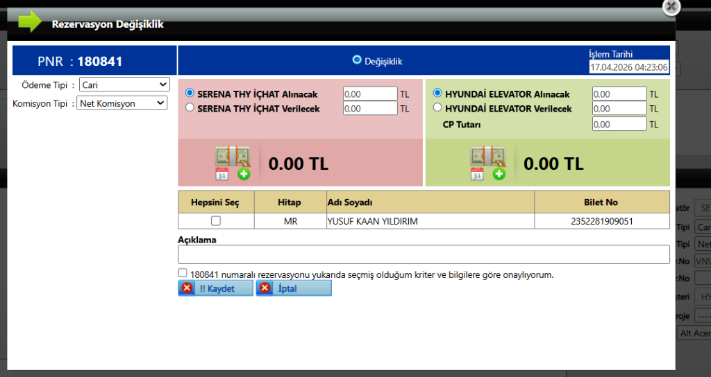
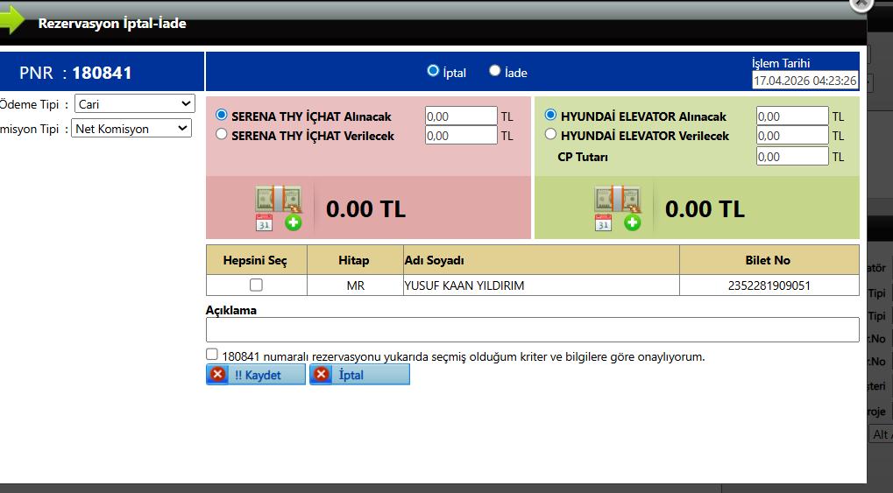

# 📖 Rezervasyon İşlemleri: Aqua -> ERPNext Geçiş Rehberi

Bu rehber, eski sistemdeki (Aqua) alışkanlıklarınızı ERPNext'e en hızlı şekilde taşımanız için hazırlanmıştır.

*Görsel 1: Eski Sistem Genel Rezervasyon Modülü*

## 1. Değişiklik ve Fark Tahsilatı (Alınacak / Verilecek)

*Görsel 2: Eski Sistem Alınacak/Verilecek Diyaloğu*
Eski sistemdeki Pembe/Yeşil kutuların mantığı şudur:

- **Alınacak (Müşteri Farkı):** ERPNext'te `Trip` içerisindeki `Sale Amount` alanına farkı ekleyin veya düşürün.
- **Verilecek (Tedarikçi Farkı):** ERPNext'te `Trip` içerisindeki `Cost Amount` alanına farkı ekleyin veya düşürün.

### 🚀 Uygulama Adımları:
1. Mevcut `Trip` dökümanına gidin.
2. Üstteki **"Amend"** butonuna basın (Bu, eski sistemdeki "Değişiklik" butonudur).
3. Yolcu satırındaki rakamları güncel tutarlarla değiştirin.
4. **Save** ve **Submit** deyin. Sistem aradaki fark için otomatik fatura/fark kaydı oluşturacaktır.

## 2. İptal ve İade (Void / Refund)
- **Hızlı İptal (Void):** Eğer biletleme hatası yapıldıysa ve faturalar henüz mühürlenmediyse, `Status` alanını **Void** yapmanız yeterlidir. Tüm taslaklar temizlenir (Eski sistemdeki "Sil" butonu).
- **Muhasebeleşmiş İade:** Eğer fatura kesildiyse, biletin içine girip **"Bileti İade Et"** (Create Return) demeniz yeterlidir. Bu, geçmişi bozmadan bugün bir iade hareketi (Credit Note) oluşturur.

## 3. PNR Ayırma ve Detaylar
Eski sistemdeki "Rez Ayır" veya "Bilet Detay" ikonları, ERPNext'te `Connections` (Bağlantılar) sekmesi altında toplanmıştır. Tek bir ekrandan o biletle ilgili tüm kesilmiş faturaları, ödemeleri ve logları görebilirsiniz.

---
> 🔗 **Teknik Senaryolar:** [raw/scenarios/](../../raw/scenarios/)
